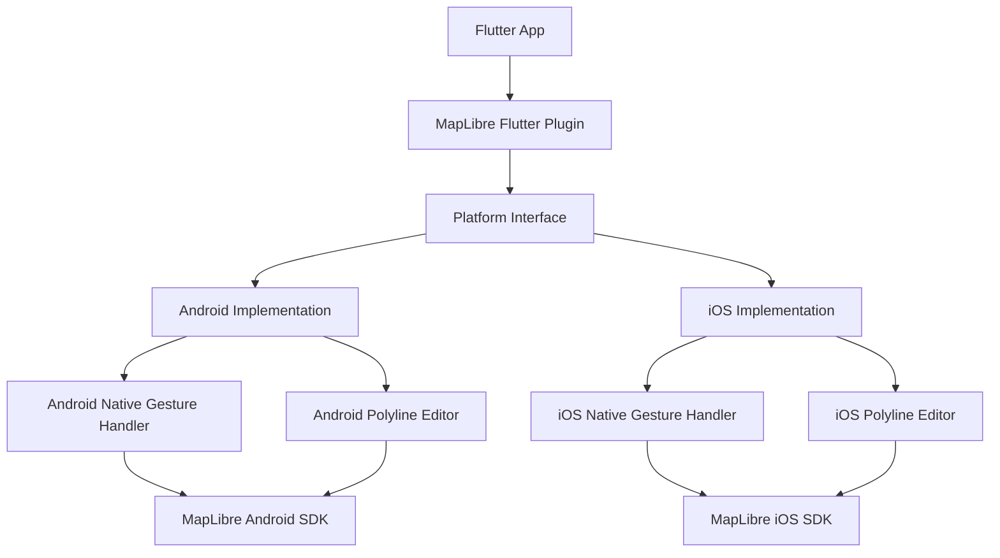
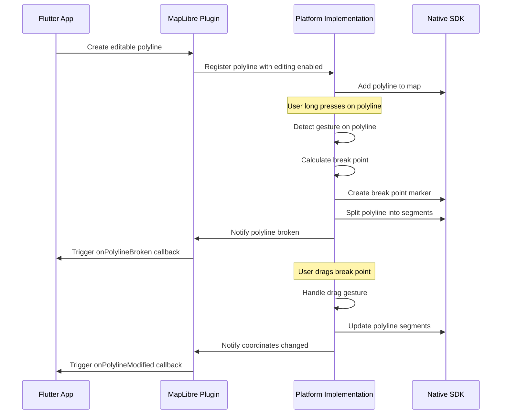

# Design Document

## Overview

The Interactive Polyline Editing feature enables users to break and modify polylines on MapLibre maps through native gesture recognition on Android and iOS platforms. The feature integrates with the existing MapLibre Flutter plugin architecture, extending the current Line annotation system with interactive editing capabilities.

The design follows MapLibre's established patterns for platform-specific features, implementing native gesture handling for optimal performance while maintaining Flutter's declarative API approach. The feature adds editing capabilities without breaking existing polyline functionality.

## Architecture

### High-Level Architecture



### Component Interaction Flow



## Components and Interfaces

### Flutter Layer Components

#### Enhanced LineOptions Class
Extends the existing `LineOptions` class to support editing capabilities:

```dart
class LineOptions {
  // Existing properties...
  final bool? editable;
  final PolylineEditingCallbacks? editingCallbacks;
  
  // New editing-specific styling
  final String? breakPointColor;
  final double? breakPointRadius;
  final String? previewLineColor;
  final double? previewLineOpacity;
}
```

#### Polyline Editing Callbacks
New callback interface for handling editing events:

```dart
class PolylineEditingCallbacks {
  final void Function(String lineId, List<LatLng> segment1, List<LatLng> segment2)? onPolylineBroken;
  final void Function(String lineId, List<LatLng> newCoordinates)? onPolylineModified;
  final void Function(String lineId, String error)? onEditingError;
}
```

#### MapLibreMapController Extensions
New methods added to the existing controller:

```dart
extension PolylineEditing on MapLibreMapController {
  Future<void> enablePolylineEditing(String lineId, bool enabled);
  Future<void> setPolylineEditingStyle(PolylineEditingStyle style);
  Future<bool> isPolylineEditable(String lineId);
}
```

### Platform Interface Layer

#### Enhanced Platform Interface
Extensions to `MapLibreGlPlatform` for editing support:

```dart
abstract class MapLibreGlPlatform {
  // Existing methods...
  
  Future<void> enableLineEditing(String lineId, bool enabled);
  Future<void> setLineEditingStyle(Map<String, dynamic> style);
  Future<void> handleLineEditingGesture(String lineId, double x, double y);
}
```

### Native Implementation Components

#### Android Implementation

**PolylineEditingManager.java**
- Manages editing state for all polylines
- Handles gesture detection and coordinate calculations
- Integrates with MapLibre Android SDK's gesture system

**PolylineGestureDetector.java**
- Custom gesture detector for long press and drag operations
- Calculates nearest point on polyline for break operations
- Provides smooth drag feedback with real-time updates

**EditablePolylineRenderer.java**
- Renders break point markers and preview lines
- Manages visual feedback during editing operations
- Handles styling for editing-specific visual elements

#### iOS Implementation

**PolylineEditingManager.swift**
- Swift equivalent of Android editing manager
- Integrates with MLNMapView gesture recognizers
- Manages editing state and coordinates with Flutter layer

**PolylineGestureHandler.swift**
- Handles UILongPressGestureRecognizer and UIPanGestureRecognizer
- Calculates geometric operations for polyline breaking
- Provides haptic feedback for enhanced user experience

**EditablePolylineRenderer.swift**
- Manages MLNAnnotation objects for break points
- Handles real-time polyline updates during drag operations
- Implements custom styling for editing visual elements

## Data Models

### Break Point Model
Represents a break point on a polyline during editing:

```dart
class PolylineBreakPoint {
  final String id;
  final String parentLineId;
  final LatLng coordinate;
  final int segmentIndex;
  final double distanceAlongSegment;
  final bool isDragging;
}
```

### Editing Session Model
Tracks the state of an active editing session:

```dart
class PolylineEditingSession {
  final String lineId;
  final PolylineBreakPoint breakPoint;
  final List<LatLng> originalCoordinates;
  final List<LatLng> segment1Coordinates;
  final List<LatLng> segment2Coordinates;
  final DateTime startTime;
}
```

### Polyline Editing Style
Configuration for visual appearance during editing:

```dart
class PolylineEditingStyle {
  final String breakPointColor;
  final double breakPointRadius;
  final String breakPointBorderColor;
  final double breakPointBorderWidth;
  final String previewLineColor;
  final double previewLineOpacity;
  final double previewLineWidth;
  final bool enableHapticFeedback;
}
```

## Error Handling

### Error Types and Handling Strategy

#### Gesture Recognition Errors
- **Invalid Touch Location**: When touch doesn't intersect with any editable polyline
- **Handling**: Silently ignore, no visual feedback
- **Logging**: Debug level logging for development

#### Geometric Calculation Errors
- **Polyline Too Short**: When polyline has insufficient points for breaking
- **Handling**: Show user-friendly error message via callback
- **Recovery**: Disable editing for problematic polylines

#### Platform Integration Errors
- **Native SDK Errors**: When MapLibre SDK operations fail
- **Handling**: Graceful degradation, disable editing temporarily
- **Recovery**: Retry mechanism with exponential backoff

#### Memory and Performance Errors
- **Complex Polyline Handling**: When polylines have too many points
- **Handling**: Implement point simplification for editing operations
- **Optimization**: Use spatial indexing for efficient hit testing

### Error Callback Implementation

```dart
void handleEditingError(String lineId, PolylineEditingError error) {
  switch (error.type) {
    case PolylineEditingErrorType.geometricCalculation:
      // Disable editing for this polyline
      disablePolylineEditing(lineId);
      break;
    case PolylineEditingErrorType.platformIntegration:
      // Retry with fallback behavior
      retryWithFallback(lineId, error);
      break;
    case PolylineEditingErrorType.performance:
      // Simplify polyline and retry
      simplifyAndRetry(lineId, error);
      break;
  }
}
```

## Testing Strategy

### Unit Testing

#### Flutter Layer Tests
- **LineOptions Extension Tests**: Verify new properties are correctly serialized
- **Callback Handling Tests**: Ensure callbacks are triggered with correct parameters
- **Controller Extension Tests**: Validate new methods integrate properly

#### Platform Interface Tests
- **Method Channel Tests**: Verify correct message passing between Flutter and native
- **Serialization Tests**: Ensure complex data structures are correctly serialized
- **Error Handling Tests**: Validate error scenarios are properly handled

### Integration Testing

#### Gesture Recognition Tests
- **Long Press Detection**: Verify long press gestures are correctly detected on polylines
- **Drag Operation Tests**: Ensure drag gestures update polylines in real-time
- **Multi-touch Handling**: Test behavior with multiple simultaneous touches

#### Cross-Platform Consistency Tests
- **Visual Consistency**: Ensure editing behavior looks identical on Android and iOS
- **Performance Consistency**: Verify similar performance characteristics across platforms
- **API Consistency**: Ensure identical Flutter API behavior regardless of platform

### End-to-End Testing

#### User Workflow Tests
- **Complete Editing Flow**: Test full user journey from long press to final polyline update
- **Multiple Polylines**: Verify editing works correctly with multiple polylines on map
- **Edge Cases**: Test with very short polylines, complex geometries, and boundary conditions

#### Performance Testing
- **Large Polyline Handling**: Test with polylines containing thousands of points
- **Memory Usage**: Monitor memory consumption during extended editing sessions
- **Frame Rate**: Ensure smooth 60fps performance during drag operations

### Automated Testing Infrastructure

#### Test Data Generation
```dart
class PolylineTestDataGenerator {
  static List<LatLng> generateComplexPolyline(int pointCount) {
    // Generate test polylines with various complexities
  }
  
  static List<LatLng> generateAirportRoute(String departureICAO, String arrivalICAO) {
    // Generate realistic aviation routes for testing
  }
}
```

#### Performance Benchmarking
```dart
class PolylineEditingBenchmark {
  static Future<BenchmarkResult> benchmarkEditingPerformance(
    List<LatLng> polylineCoordinates,
    int editingOperations
  ) {
    // Measure performance metrics during editing operations
  }
}
```

The testing strategy ensures robust functionality across all supported platforms while maintaining the high performance standards expected for interactive map features. The comprehensive test suite covers both functional correctness and performance characteristics essential for a smooth user experience.